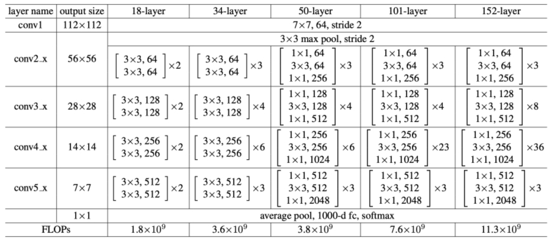

# cnn_latency
Предсказание времени выполнения cnn модели на основе её признаков

Задача поставлена достаточно абстрактно, поэтому, по крайней мере, в первых подходах добавим некоторой частности. б/удем рассматривать реальную рабочую архитектуру, в качестве таковой возьмём ResNet.

- 
